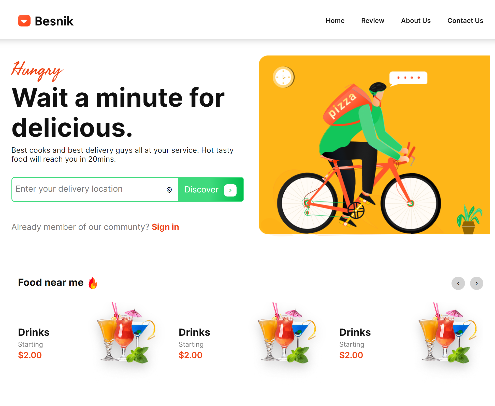

# food_delivery
Trong bài này sẽ sử dụng thư viện swiper js, kiến thức grid css & subgrid, và mẫu template này lấy từ 

Figma:https://www.figma.com/file/TdyT0CSoqM7pwjQ2pHqjBB/FoodDelivery-(1)?type=design&node-id=0%3A1&mode=design&t=FiGm40QqFD5Bxq6L-1

Nếu các bạn có thắc mắc hoặc ý kiến xin gửi về email ware4u@gmail.com

Xem hướng dẫn ở url youtube:https://www.youtube.com/@html-css-co-ban. 

Mong các bạn cho ý kiến để hoàn thiện tốt hơn.

Chân thành cảm ơn!

